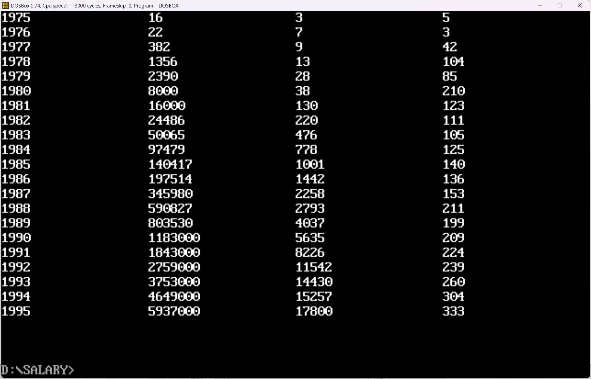

# 第五次作业

**本次作业所有源码均在`\codes\salary`路径下**



### 总体架构

**本次作业主要构建了4个模块：**

1. **`main.asm`主模块**：主要负责数据的定义，同时程序从该处开始执行。
2. **`cal.asm`计算模块：**主要负责计算人均工资，并将所有数据存到`table`中。
3. **`load.asm`读取模块：**主要负责将数据从`table`中读取到一个专用的`output_buffer`里，以便后续打印输出。
4. **`shw.asm`显示模块：**主要负责清屏以及在屏幕上显示内容。

### 核心功能

1. **计算人均工资：**

   ```assembly
   ; 4. 计算人均收入（WORD，2 字节）
       XOR DX, DX             ; 清除 DX 高位
       MOV CX, AX             ; CX = 雇员人数（保存在 CX 中）
   
       ; 计算总收入的偏移量
       MOV AX, BX             ; BX = 年份索引
       SHL AX, 1              ; AX = 年份索引 * 4（DWORD 偏移量）
       SHL AX, 1
       MOV SI, OFFSET total   ; SI 指向 total 起始地址
       ADD SI, AX             ; SI = total + (年份索引 * 4)
   
       ; 读取总收入
       MOV AX, DS:[SI]        ; AX = 总收入低 16 位
       ADD SI, 2              ; 移动到高 16 位
       MOV DX, DS:[SI]        ; DX = 总收入高 16 位（如果总收入是 DWORD）
   
       ; 计算人均收入
       DIV CX                 ; EAX = DX:AX / CX，结果保存在 AX
   
       ; 写入人均收入到 TABLE 段
       MOV ES:[DI], AX        ; 将人均收入写入 TABLE 段
       ADD DI, 2              ; 移动指针
   ```

   主要使用`SI`来指向原始数据，用BX来表示当前是第几年（计算偏移）。

2. **双字整数转换为字符串：**

   ```assembly
   ;32位除法，被除数和商放在DX:AX,除数放在BX,余数放在CX
   dword_div PROC
       PUSH BX
   
       PUSH AX
       MOV AX, DX ;先进行高16位的除法
       XOR DX, DX
       DIV BX      ; 余数在DX，商 AX 暂存在 CX
       MOV CX, AX
   
       POP AX ;低16位除法
       DIV BX
       PUSH DX ; 余数在DX，高16位商在CX，两者交换
       MOV DX, CX
       POP CX
   
       POP BX
       RET
   
   dword_div ENDP
   ```

   先进行高16位除法，保存其中的商在CX，而余数放在DX和低16位一起参与第二次除法，最终将高16位的商放回DX，余数放在CX，这样我们32位除法的商就可以在最后保留在`DX:AX`上。

3. **直接操作显存来改变显示内容：**

   ```assembly
   ; 打印字符串函数
   print_string PROC
       PUSH AX
       PUSH BX
       PUSH CX
       PUSH SI
       PUSH DI
       PUSH ES
   
       MOV AX, 0B800h
       MOV ES, AX
       CLD
       MOV SI, OFFSET output_buffer
   print_loop:
       LODSB
       CMP AL, '$'
       JZ print_done
   
       MOV ES:[DI], AL
       MOV AL, color                    ; 使用 color 变量
       MOV ES:[DI+1], AL
       ADD DI, 2
       JMP print_loop
   print_done:
       POP ES
       POP DI
       POP SI
       POP CX
       POP BX
       POP AX
       RET
   print_string ENDP
   ```

   通过将显存地址加载到寄存器，后续就可以通过间接寻址的方式来修改显存的内容。

4. **如何多文件连接运行：**

   ```assembly
   EXTRN clear_screen:PROC, print_string:PROC  ; 声明子模块中的过程
   EXTRN calculate_average:PROC
   EXTRN load_avg:PROC, load_dnum:PROC, load_num:PROC, load_year:PROC
   PUBLIC year, total, em, color, output_buffer, table
   
   DATA_SEGMENT segment PUBLIC
   ;以下是表示 21 年的 21 个字符串
       year db '1975','1976','1977','1978','1979','1980','1981','1982','1983'
            db '1984','1985','1986','1987','1988','1989','1990','1991','1992'
            db '1993','1994','1995'
       ;以下是表示 21 年公司总收的 21 个 dword 型数据
       total dd 16,22,382,1356,2390,8000,16000,24486,50065,97479,140417,197514
             dd 345980,590827,803530,1183000,1843000,2759000,3753000,4649000,5937000
       ;以下是表示 21 年公司雇员人数的 21 个 word 型数据
       em dw 3,7,9,13,28,38,130,220,476,778,1001,1442,2258,2793,4037,5635,8226
          dw 11542,14430,15257,17800
       color db 0Fh
       output_buffer db 256 dup('$')
       newline     DB 0Dh, 0Ah, '$'  ; 换行符，用于输出换行
       spacer DB ' $'
   DATA_SEGMENT ends
   
   TABLE_SEGMENT segment PUBLIC
       table db 21 dup('year summ ne ?? ')
   TABLE_SEGMENT ends
   ```

   在写源代码的时候，使用`EXTRN`关键字表明这是外部的内容，`PUBLIC`关键字来表明内容多文件共享。最后连接的时候，只需要：

   ```bash
   link file1.obj+file2.obj+...+fileN.obj
   ```

   
