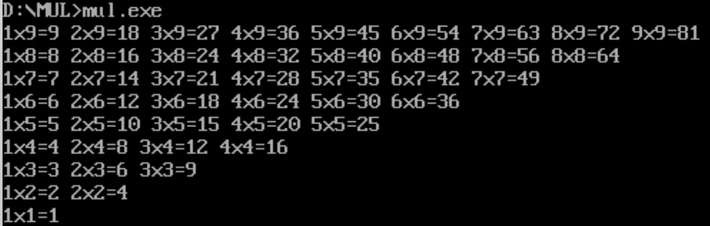
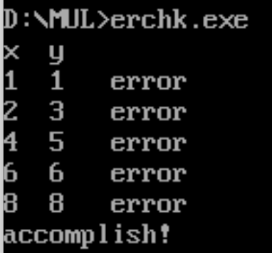

# 作业4：九九乘法表

---

### 前置：8086如何输入字符串、ASCII码与数字如何互相转换

上述问题在作业二和作业三都没有非常好地去解决，同时这两个问题非常重要，后续汇编项目中可预见的会有大量需要上述操作的情况，因此在本次作业前，本人先重新研究了一下。

#### 8086如何输入字符串

- 首先，可以确定的是需要调用功能号0ah的中断

- 重点是调用该中断的前置需求：

  - 需要在数据段定义一个缓冲区来存储输入的内容

    ```assembly
    DATA_SEG SEGMENT
        buffer DB 50, ?, 50 DUP('$')
    DATA_SEG ENDS
    ```

    其中buffer缓冲区需要定义三部分的存储空间：一个字节用于存储：缓冲区的最大长度，一个字节用于存储：实际输入的内容的字节数（由系统中断自行填入），一段空间用于存储：对应大小的存储空间（以及对应的初始值）。上述定义缓冲区的代码中，第一个定义的字节`50`代表的就是缓冲区的最大长度，随后定义的一个字节`?`预留给系统填入实际输入的字节数，最后的`50 DUP('$')`代表定义50字节的空间，初始值为`'$'`。

- 前置需求满足后，将DX指向buffer，并调用对应功能号即可使用字符串输入的功能。

- 字符串输入后，如何获取输入的内容：

  - **`buffer[0]`:** 缓冲区的最大长度
  - **`buffer[1]`:**实际输入的字节数（不包括回车）
  - **`buffer[2]`之后的内容：**真正输入的字符串。

#### ASCII码如何转换为数字

- 基本思路与使用高级语言进行字符串转换时一样：正序遍历字符串

  - ans乘10

  - 当前位cur减'0'
  - ans=ans+cur
  - 重复直到字符串遍历完

- 如何在汇编中实现：

  ```assembly
  ;把buffer里的数字转换并放入ax
  CONVERT_INPUT PROC
      PUSH BX
      PUSH CX
      PUSH DX
      PUSH SI
      PUSH DI
      MOV AX, 0          ; 清空 AX，存储结果
      LEA SI, buffer+2   ; SI 指向 buffer+2，即输入字符串的第一个字符
  
  ConvertLoop:
      MOV BL, [SI]       ; 将当前字符读取到 BL
      CMP BL, 0Dh        ; 检查是否遇到回车符 (0Dh)
      JE DoneConvert     ; 如果遇到回车，结束转换
  
      SUB BL, '0'        ; 将 ASCII 数字字符转换为数值 ('0' -> 0, '1' -> 1, ..., '9' -> 9)
      MOV BH, 0          ; 清空高字节
      MOV CX, 10         ; 准备乘以 10
      MUL CX             ; AX = AX * 10 (为新的数字腾出位置)
      ADD AX, BX         ; 将转换的数值加到 AX 中
  
      INC SI             ; 指向下一个字符
      JMP ConvertLoop    ; 继续转换下一个字符
  
  DoneConvert:
      POP DI
      POP SI
      POP DX
      POP CX
      POP BX
      RET                ; 返回主程序
  
  CONVERT_INPUT ENDP
  ```

#### 数字如何转换为ASCII码

- 基本思路与高级语言的转换类似：倒序填入字符串

  - str[cur] = num % 10 + '0'
  - num = num / 10
  - cur--
  - 直到num == 0

- 如何写成汇编：

  ```assembly
  ; 将 AX 中的数值转换为字符串并存储在 output_buffer 中
  NumberToString PROC NEAR
      PUSH AX
      PUSH BX
      PUSH CX
      PUSH DX
      PUSH SI
      PUSH DI
  
      MOV CX, 0         ; 初始化位数计数器
      MOV BX, 0Ah
      LEA SI, output_buffer + 49  ; SI 指向 output_buffer 的末尾
      MOV BYTE PTR [SI], '$'      ; 在缓冲区末尾存入结束符 '$'
      DEC SI                      ; 移到存储数字字符的位置
  
  ConvertToStringLoop:
      XOR DX, DX        ; 清除 DX，用于除法操作
      DIV BX            ; AX = AX / 10, DX = AX % 10 (余数放在 DX 中)
      ADD DL, '0'       ; 将数字转换为字符（0-9）
      MOV [SI], DL      ; 将字符存入缓冲区
      DEC SI            ; 移动到下一个存储位置
      INC CX            ; 计数
  
      CMP AX, 0         ; 如果 AX 不为 0，继续转换
      JNE ConvertToStringLoop
  
      INC SI            ; SI 现在指向第一个有效数字的位置
  
      ; 移动有效字符串部分到缓冲区的起始位置
      LEA DI, output_buffer      ; DI 指向 output_buffer 的起始位置
  MoveString:
      MOV AL, [SI]              ; 将有效字符读取到 AL
      MOV [DI], AL              ; 将字符写入缓冲区起始位置
      INC SI                    ; 移动到下一个字符
      INC DI                    ; 移动到下一个写入位置
      CMP AL, '$'               ; 检查是否到达结束符
      JNE MoveString            ; 如果不是结束符，继续移动
  
      POP DI
      POP SI
      POP DX
      POP CX
      POP BX
      POP AX
      RET               ; 返回主程序
  NumberToString ENDP
  ```

  其中重点在于8086的16位除法会把除的结果放在AX，余数放在DX。其次就是需要把转换后的字符串从buffer结尾放到开头（以便后续输出打印）

---

### 第一部分：打印九九乘法表

本次作业主要关键在于把等式左右侧的内容连接到一起并输出，本次使用的方法如下：

- 求出结果后先转换为字符串存储到一个buffer1中
- 在另一个buffer2中按序（从左到右）填入等式内容，结果的部分用两个指针逐字节复制。

核心代码如下：

```assembly
; 打印99乘法表
PrintMultiplicationTable PROC NEAR
    PUSH AX
    PUSH BX
    PUSH CX
    PUSH DX
    PUSH SI
    PUSH DI

    MOV CX, 9          ; 外循环次数 (1 到 9)
OuterLoop:
    MOV BX, 1          ; 内循环初始化 (1 到 CX)
InnerLoop:
    MOV AX, CX         ; AX = 当前外循环数值
    MUL BX             ; AX = CX * BX
    CALL NumberToString ; 将乘积转换为字符串，结果在 output_buffer 中

    ; 准备输出 "BX * CX = 结果"
    MOV DL, '0'
    ADD DL, BL        ; 将 BX 转换为字符
    MOV mul_table_buffer, DL

    MOV DL, 'x'
    MOV mul_table_buffer + 1, DL

    MOV DL, '0'
    ADD DL, CL       ; 将 CX 转换为字符
    MOV mul_table_buffer + 2, DL

    MOV DL, '='
    MOV mul_table_buffer + 3, DL

    ; 将转换后的乘积复制到 mul_table_buffer 中
    LEA SI, output_buffer
    LEA DI, mul_table_buffer + 4
CopyResult:
    MOV AL, [SI]
    MOV [DI], AL
    INC SI
    INC DI
    CMP AL, '$'
    JNE CopyResult

    DEC DI
    MOV DL, 32
    MOV [DI], DL

    INC DI
    MOV DL, '$'
    MOV [DI], DL

    ; 输出当前的结果行
    LEA DX, mul_table_buffer
    MOV AH, 09h
    INT 21h

    INC BX             ; 内循环递增
    CMP BX, CX
    JLE InnerLoop      ; 如果 BX <= CX，继续内循环

    ; 添加换行符
    LEA DX, newline
    MOV AH, 09h
    INT 21h

    LOOP OuterLoop     ; 外循环递减，继续下一个外循环

    POP DI
    POP SI
    POP DX
    POP CX
    POP BX
    POP AX
    RET
PrintMultiplicationTable ENDP
```

结果如图所示



### 第二部分：乘法表纠错

该部分任务关键在于用双重循环的index来获取table对应位置的指针，以及把相乘后的结果与table对应值进行比较。与此同时需要对寄存器的使用要有一定管理（乘法刚需使用AX。需要使用栈进行暂存，以解决四个寄存器不够用的情况）

- (BX - 1) * 9 + CX - 1 = 当前指向table的指针。BX为外循环index，CX为内循环index

核心代码如下：

```assembly
    MOV BX, 1                   ; BX代表当前行数
OUTERLOOP:
    MOV CX, 1                   ; CX代表当前列数
INNERLOOP:
    MOV AX, 9

    PUSH BX                     ; (BX - 1) * 9 + CX - 1 = 当前指向table的指针
    DEC BX
    MUL BX
    POP BX

    ADD AX, CX
    DEC AX

    PUSH BX
    MOV BX, AX
    MOV AH, 0
    MOV AL, [table + BX]        ; AX 内变为当前table的值
    POP BX

    CALL CHK

    INC CX
    CMP CX, 9
    JLE INNERLOOP

    INC BX
    CMP BX, 9
    JLE OUTERLOOP
```

```ass
;判断AX是否等于BX*CX，并打印所有错误结果
CHK PROC
    PUSH AX
    PUSH BX
    PUSH CX

    PUSH CX

    PUSH CX
    PUSH AX
    POP CX
    POP AX          ; AX, CX 互换，以便进行乘法操作

    MUL BX
    CMP AX, CX
    POP CX
    JE RIGHT

WRONG:
    MOV AX, BX
    CALL NumberToString

    ; 打印BX
    LEA DX, output_buffer      ; DX指向 output_buffer
    MOV AH, 09h                ; 功能号09h - 输出字符串
    INT 21h                    ; 调用DOS中断

    LEA DX, spacer             
    MOV AH, 09h                
    INT 21h    

    MOV AX, CX
    CALL NumberToString

    ; 打印CX
    LEA DX, output_buffer      ; DX指向 output_buffer
    MOV AH, 09h                ; 功能号09h - 输出字符串
    INT 21h                    ; 调用DOS中断

    LEA DX, error             
    MOV AH, 09h                
    INT 21h

    LEA DX, newline             
    MOV AH, 09h                
    INT 21h 

RIGHT:
    POP CX
    POP BX
    POP AX
    RET
CHK ENDP
```

结果如下：


