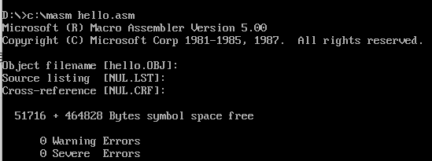
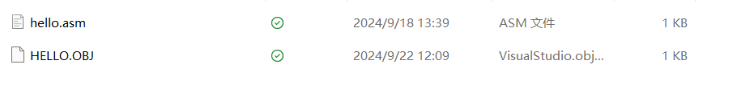
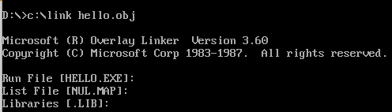
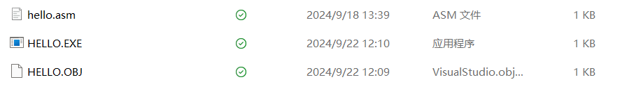
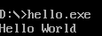
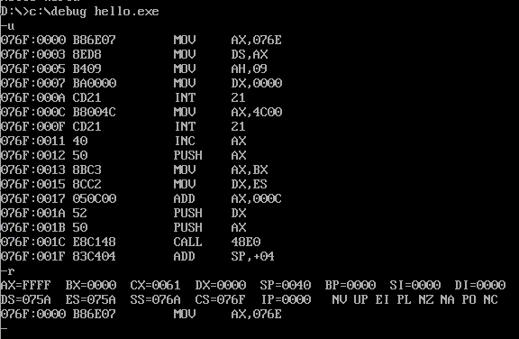
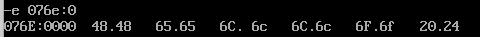
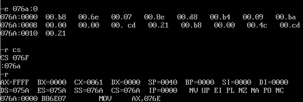
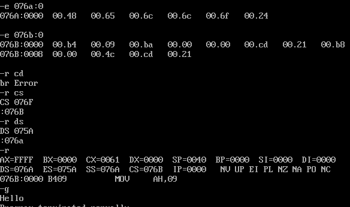

# 编译运行hello.asm

1. **用masm生成obj文件**

   

   

   

2. **链接生成可执行文件**

   

   

3. **运行可执行文件**

   

   ---

# 通过直接修改内存以执行输出hello的操作

1. **进入debug模式**

   

2. **观察到：`"Hello World$"`对应的`DATASEG`地址是`076E`，因此对`076E`地址的数据进行直接修改为：`48 65 6c 6c 6f 24`**

   

3. **把`076A`作为代码段，直接把代码放入内存，并修改`CS=076A`**

   

4. **运行修改后的代码**

   

---

**PS:** 个人认为，在代码段中有一个把`DS`的值赋值为`DATASEG`的操作，因此不需要再去手动修改`DS`寄存器的值（因为代码段会帮忙修改），除非我们的代码不再有修改`DS`寄存器的操作：

```
MOV AX,DATASEG
MOV DS,AX
```



上述情况就是代码段不再有寄存器赋值的操作，此时我们的`DS`段就必须是我们想要打印的数据内容。