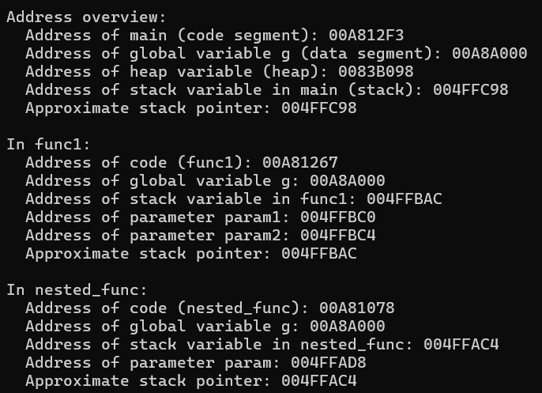
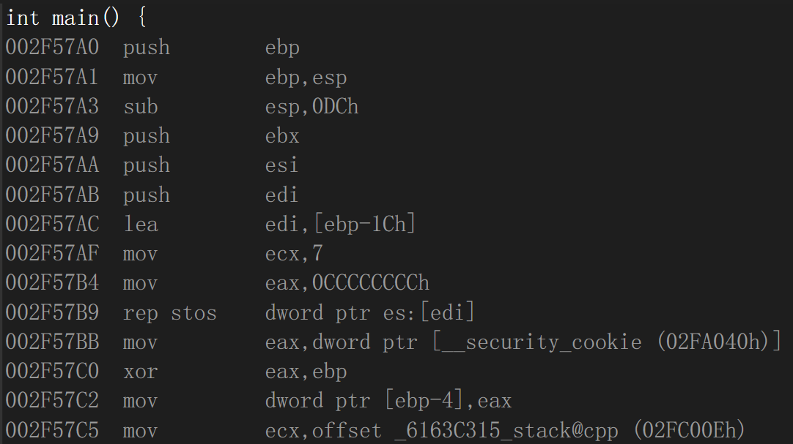
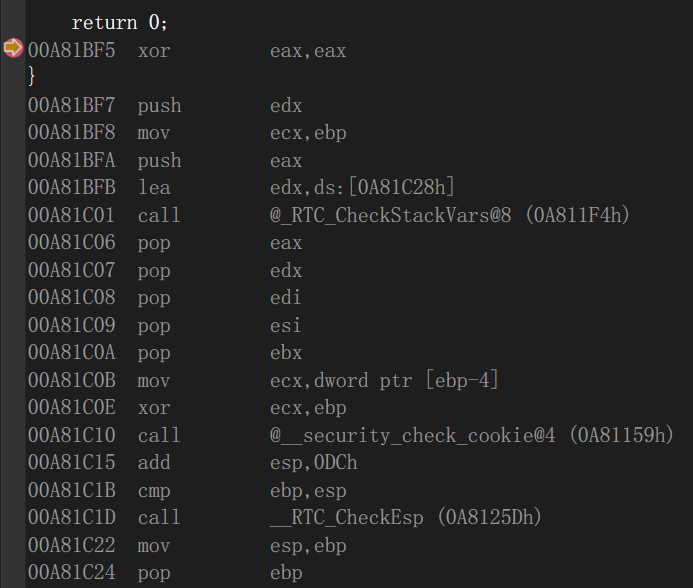

# MSVC 编译器下代码各部分地址

C++源代码如下：

```c++
#include <stdio.h>
#include <stdlib.h>

int g = 42; // 全局变量，位于数据段（.data 或 .bss）

void nested_func(int param) {
    int nested_stack_var = 0; // 局部变量，位于栈区
    printf("In nested_func:\n");
    printf("  Address of code (nested_func): %p\n", (void*)nested_func);
    printf("  Address of global variable g: %p\n", (void*)&g);
    printf("  Address of stack variable in nested_func: %p\n", (void*)&nested_stack_var);
    printf("  Address of parameter param: %p\n", (void*)&param);
    printf("  Approximate stack pointer: %p\n\n", (void*)&nested_stack_var);
}

void func1(int param1, int param2) {
    int func1_stack_var = 0; // 局部变量，位于栈区
    printf("In func1:\n");
    printf("  Address of code (func1): %p\n", (void*)func1);
    printf("  Address of global variable g: %p\n", (void*)&g);
    printf("  Address of stack variable in func1: %p\n", (void*)&func1_stack_var);
    printf("  Address of parameter param1: %p\n", (void*)&param1);
    printf("  Address of parameter param2: %p\n", (void*)&param2);
    printf("  Approximate stack pointer: %p\n\n", (void*)&func1_stack_var);

    // 调用嵌套函数
    nested_func(param1 + param2);
}

int main() {
    printf("Address overview:\n");

    // 打印代码段起始地址
    printf("  Address of main (code segment): %p\n", (void*)main);

    // 打印全局变量（数据段）
    printf("  Address of global variable g (data segment): %p\n", (void*)&g);

    // 打印堆区地址
    void* heap_var = malloc(1);
    printf("  Address of heap variable (heap): %p\n", heap_var);
    free(heap_var);

    // 打印栈区地址
    int main_stack_var = 0;
    printf("  Address of stack variable in main (stack): %p\n", (void*)&main_stack_var);
    printf("  Approximate stack pointer: %p\n\n", (void*)&main_stack_var);

    // 调用一级函数，传递两个参数
    func1(10, 20);

    return 0;
}

```



如上图可以看到，地址从小到大排序为：**栈，堆，代码段，数据段**。此外，栈区地址是**向低地址增长**的。

在Visual Studio的项目下，分配给程序的栈空间大小默认为**1MB**，可以在项目设置中调整大小。





通过函数开关和结尾反汇编可以看到，每个函数都被分配了一部分**“栈帧”**，用于专门存储该函数的**参数，返回地址，基址**等信息。这个栈帧同时也是栈空间的一部分。